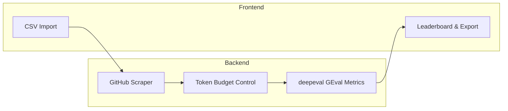

# ⚖️ Hackathon Judge

[中文文档](README_CN.md)

**AI-powered hackathon project evaluation platform.** Import projects via CSV, scrape GitHub repos, run LLM-based evaluation across customizable dimensions, and view results on an interactive leaderboard.

## Architecture



| Layer | Technology |
|-------|-----------|
| Backend API | FastAPI |
| Frontend | Streamlit |
| Database | SQLite (async via aiosqlite) |
| LLM Integration | LiteLLM (multi-provider) |
| Evaluation Framework | deepeval GEval |
| GitHub Scraping | PyGithub |

## Features

- **Multi-provider LLM support** — OpenAI, Anthropic, Google Gemini, DeepSeek, and any provider supported by LiteLLM
- **4 default evaluation dimensions** — Technical Soundness, Feature Alignment, UI/UX Innovation, Code Freshness
- **Customizable rubrics** — Add, edit, or remove dimensions with custom criteria and evaluation steps
- **Hard rules** — Programmatic pass/fail checks (README contains keyword, file exists, minimum commit count)
- **GitHub scraping** — Auto-fetches README, file tree, source code, config files, and commit history
- **Token budget control** — Smart prioritization and truncation to fit within LLM context limits
- **Interactive leaderboard** — Weighted scores, radar charts, per-dimension comparison, conditional coloring
- **Per-project reasoning** — Full LLM reasoning for every score, viewable in the UI
- **Excel export** — Download results with leaderboard + detailed sheets
- **Per-dimension model override** — Use different models for different evaluation dimensions

## Quick Start

### Prerequisites

- Python 3.10+
- An API key for at least one LLM provider

### Install

```bash
git clone https://github.com/ZhanlinCui/Hackathon-Judge.git
cd Hackathon-Judge
pip install -e .
```

### Configure

```bash
cp .env.example .env
# Edit .env and add your API keys
```

### Run

```bash
# Option 1: Use the start script
./start.sh

# Option 2: Start manually
uvicorn hackathon_judge.main:app --host 127.0.0.1 --port 8000 &
streamlit run frontend/app.py --server.port 8501
```

- **API:** http://127.0.0.1:8000 (Docs: http://127.0.0.1:8000/docs)
- **UI:** http://127.0.0.1:8501

### Usage

1. **Config** — Enter your LLM API key and GitHub token
2. **Rubrics** — Review the 4 default dimensions (or customize them)
3. **Import** — Upload a CSV with project info, then scrape GitHub repos
4. **Evaluate** — Run AI evaluation (takes ~10s per project per dimension)
5. **Leaderboard** — View ranked results, radar charts, and export to Excel

## CSV Format

| Column | Required | Description |
|--------|----------|-------------|
| `title` | Yes | Project name |
| `description` | No | Short description |
| `github_url` | No | GitHub repository URL |
| `demo_url` | No | Demo or video link |
| `pitch_text` | No | Pitch / elevator description |

A sample CSV is included at `data/sample_projects.csv`.

## Evaluation Dimensions

| Dimension | Weight | What it evaluates |
|-----------|--------|-------------------|
| Technical Soundness | 30% | Code architecture, technology choices, engineering best practices |
| Feature Alignment | 25% | How well the code delivers on the project's stated goals |
| UI/UX Innovation | 20% | Design quality, usability, innovative interaction patterns |
| Code Freshness | 25% | Whether the code was genuinely built during the hackathon |

All dimensions are fully customizable — you can edit criteria, evaluation steps, weights, or add entirely new dimensions.

## Supported LLM Providers

| Provider | Model Format | Env Var |
|----------|-------------|---------|
| OpenAI | `gpt-4o`, `gpt-4o-mini` | `OPENAI_API_KEY` |
| Anthropic | `anthropic/claude-sonnet-4-20250514` | `ANTHROPIC_API_KEY` |
| Google Gemini | `gemini/gemini-2.5-flash` | `GEMINI_API_KEY` |
| DeepSeek | `deepseek/deepseek-chat` | `DEEPSEEK_API_KEY` |

Any model supported by [LiteLLM](https://docs.litellm.ai/docs/providers) can be used.

## API Endpoints

The backend exposes 20 RESTful API endpoints. Full interactive docs at `http://127.0.0.1:8000/docs`.

| Category | Endpoints |
|----------|-----------|
| Hackathons | CRUD operations |
| Projects | Import CSV, list, get details, scrape |
| Rubrics | CRUD for dimensions and hard rules |
| Evaluation | Start run, get status, get scores |
| Leaderboard | Aggregated weighted scores |
| Export | Excel download |
| Config | Runtime settings CRUD |

## License

MIT
