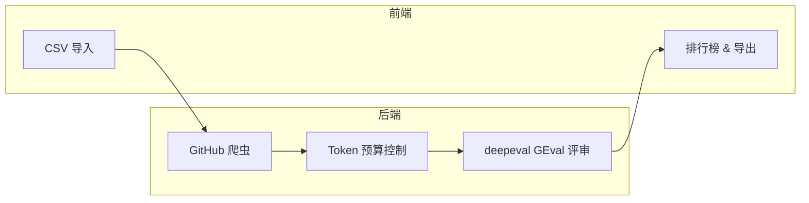

# ⚖️ Hackathon Judge

[English](README.md)

**AI 驱动的黑客松项目评审平台。** 通过 CSV 导入项目，自动抓取 GitHub 仓库，使用 LLM 按可自定义维度进行评审，在交互式排行榜上展示结果。

## 架构



| 层级 | 技术 |
|------|------|
| 后端 API | FastAPI |
| 前端 | Streamlit |
| 数据库 | SQLite（异步 aiosqlite） |
| LLM 集成 | LiteLLM（多供应商） |
| 评审框架 | deepeval GEval |
| GitHub 抓取 | PyGithub |

## 功能特性

- **多供应商 LLM 支持** — OpenAI、Anthropic、Google Gemini、DeepSeek，以及 LiteLLM 支持的所有供应商
- **4 个默认评审维度** — 技术实力、功能对齐、界面创新、代码新鲜度
- **可自定义评审标准** — 添加、编辑或删除维度，自定义评审准则和评估步骤
- **硬性规则** — 程序化通过/不通过检查（README 包含关键词、文件存在性、最少提交数）
- **GitHub 抓取** — 自动获取 README、文件树、源代码、配置文件和提交历史
- **Token 预算控制** — 智能优先级和截断，适配 LLM 上下文限制
- **交互式排行榜** — 加权评分、雷达图、维度对比、条件着色
- **逐项目推理说明** — 每个评分都有完整的 LLM 推理过程，可在界面中查看
- **Excel 导出** — 下载包含排行榜和详细评分的 Excel 文件
- **按维度选择模型** — 不同评审维度可使用不同的 LLM 模型

## 快速开始

### 前置要求

- Python 3.10+
- 至少一个 LLM 供应商的 API Key

### 安装

```bash
git clone https://github.com/ZhanlinCui/Hackathon-Judge.git
cd Hackathon-Judge
pip install -e .
```

### 配置

```bash
cp .env.example .env
# 编辑 .env 文件，填入你的 API Key
```

### 启动

```bash
# 方式一：使用启动脚本
./start.sh

# 方式二：手动启动
uvicorn hackathon_judge.main:app --host 127.0.0.1 --port 8000 &
streamlit run frontend/app.py --server.port 8501
```

- **API:** http://127.0.0.1:8000（文档: http://127.0.0.1:8000/docs）
- **界面:** http://127.0.0.1:8501

### 使用流程

1. **⚙️ 配置** — 输入你的 LLM API Key 和 GitHub Token
2. **📋 评审标准** — 查看默认的 4 个评审维度（或自定义）
3. **📥 导入** — 上传项目 CSV 文件，然后抓取 GitHub 仓库
4. **🔬 评审** — 运行 AI 评审（每个项目每个维度约 10 秒）
5. **🏆 排行榜** — 查看排名结果、雷达图，导出 Excel

## CSV 格式

| 列名 | 必填 | 说明 |
|------|------|------|
| `title` | 是 | 项目名称 |
| `description` | 否 | 项目简介 |
| `github_url` | 否 | GitHub 仓库地址 |
| `demo_url` | 否 | 演示或视频链接 |
| `pitch_text` | 否 | 项目 Pitch / 电梯演讲 |

示例 CSV 文件位于 `data/sample_projects.csv`。

## 评审维度

| 维度 | 权重 | 评审内容 |
|------|------|----------|
| 技术实力 (Technical Soundness) | 30% | 代码架构、技术选型、工程最佳实践 |
| 功能对齐 (Feature Alignment) | 25% | 代码是否实现了项目声称的功能 |
| 界面创新 (UI/UX Innovation) | 20% | 设计质量、可用性、创新交互模式 |
| 代码新鲜度 (Code Freshness) | 25% | 代码是否在黑客松期间真正开发 |

所有维度都完全可自定义 — 可以编辑评审准则、评估步骤、权重，或添加全新维度。

## 支持的 LLM 供应商

| 供应商 | 模型格式 | 环境变量 |
|--------|----------|----------|
| OpenAI | `gpt-4o`, `gpt-4o-mini` | `OPENAI_API_KEY` |
| Anthropic | `anthropic/claude-sonnet-4-20250514` | `ANTHROPIC_API_KEY` |
| Google Gemini | `gemini/gemini-2.5-flash` | `GEMINI_API_KEY` |
| DeepSeek | `deepseek/deepseek-chat` | `DEEPSEEK_API_KEY` |

支持 [LiteLLM](https://docs.litellm.ai/docs/providers) 所有模型。

## API 接口

后端提供 20 个 RESTful API 端点。完整交互式文档：`http://127.0.0.1:8000/docs`

| 分类 | 端点 |
|------|------|
| 黑客松 | CRUD 操作 |
| 项目 | CSV 导入、列表、详情、抓取 |
| 评审标准 | 维度和硬性规则的 CRUD |
| 评审 | 启动评审、查看状态、获取评分 |
| 排行榜 | 加权评分聚合 |
| 导出 | Excel 下载 |
| 配置 | 运行时设置 CRUD |

## 许可证

MIT
