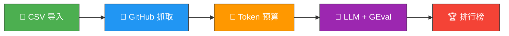

<p align="center">
  <h1 align="center">⚖️ Hackathon Auto Judge</h1>
  <p align="center">
    <strong>AI 驱动的黑客松项目评审平台</strong>
  </p>
  <p align="center">
    导入项目 · 抓取仓库 · LLM 评分 · 生成排行榜
  </p>
  <p align="center">
    <a href="https://www.python.org/downloads/"></a>
    <a href="LICENSE"></a>
    <a href="https://github.com/ZhanlinCui/Hackathon-Auto-Judge/stargazers"></a>
    <a href="https://github.com/ZhanlinCui/Hackathon-Auto-Judge/issues"></a>
  </p>
  <p align="center">
    <a href="README.md">🇺🇸 English</a> · <a href="#-快速开始">快速开始</a> · <a href="http://127.0.0.1:8000/docs">API 文档</a>
  </p>
</p>

---

## 🤔 为什么需要 Hackathon Auto Judge？

黑客松评审是一件**痛苦的事**。几十个仓库、风格各异的演示、主观的评分标准 — 完全无法规模化。

**Hackathon Auto Judge 自动化了这一切。** 它抓取每个项目的 GitHub 仓库，通过 [deepeval](https://github.com/confident-ai/deepeval) GEval 指标将代码送给 LLM 评审，产出**结构化、可解释的评分** — 每个分数都有完整的推理过程。

> **面向黑客松主办方：** 公平、一致、可规模化的评审。<br/>
> **面向参赛者：** 透明、可理解的项目反馈。

---

## ✨ 核心特性

<table>
<tr>
<td width="33%" valign="top">

### 🔬 LLM 评审
使用任意 LLM 按可自定义维度评分。基于 deepeval GEval — 生产级 LLM 测试框架。

</td>
<td width="33%" valign="top">

### 🔗 GitHub 抓取
自动获取 README、文件树、源代码、配置文件和提交历史。智能文件筛选优先抓取 `src/`、`app/`、`lib/` 目录。

</td>
<td width="33%" valign="top">

### 📊 多维度评审
4 个内置维度：技术实力、功能对齐、界面创新、代码新鲜度。支持添加自定义维度。

</td>
</tr>
<tr>
<td width="33%" valign="top">

### 🏆 交互式排行榜
加权评分、雷达图、条件着色、按维度排序。一键导出 Excel。

</td>
<td width="33%" valign="top">

### 🧠 可解释评分
每个分数都附带完整的 LLM 推理过程。清楚了解项目在每个维度上*为什么*得高分或低分。

</td>
<td width="33%" valign="top">

### 🌐 多供应商 LLM
OpenAI、Anthropic、Google Gemini、DeepSeek — 或通过 [LiteLLM](https://github.com/BerriAI/litellm) 接入 100+ 供应商。可按维度混用不同模型。

</td>
</tr>
</table>

---

## ⚙️ 工作原理



| 步骤 | 说明 |
|------|------|
| **1. 导入** | 上传包含项目信息的 CSV（标题、GitHub URL、描述） |
| **2. 抓取** | 系统通过 GitHub API 获取 README、源代码、配置文件和提交历史 |
| **3. 评审** | 每个项目通过 [deepeval GEval](https://docs.confident-ai.com/docs/metrics-llm-evals) 在配置的维度上由 LLM 评分 |
| **4. 查看** | 查看排行榜、阅读每个分数的推理过程、导出 Excel |

---

## 🚀 快速开始

**1. 安装**

```bash
git clone https://github.com/ZhanlinCui/Hackathon-Auto-Judge.git
cd Hackathon-Auto-Judge
pip install -e .
```

**2. 配置**

```bash
cp .env.example .env
# 填入至少一个 LLM API Key（OpenAI / Gemini / Anthropic / DeepSeek）
# 填入 GitHub Token 用于仓库抓取（可选但推荐）
```

**3. 启动**

```bash
./start.sh
# API  → http://127.0.0.1:8000  (Swagger 文档在 /docs)
# 界面 → http://127.0.0.1:8501
```

就这么简单。打开界面，配置 API Key，导入 CSV，运行评审。

---

## 📋 评审维度

默认提供 4 个维度，全部可自定义 — 编辑评审准则、评估步骤、权重，或添加全新维度。

<details>
<summary><strong>🔧 技术实力 (Technical Soundness)</strong> — 30% 权重</summary>

**评审准则：** 评估代码架构、技术选型、错误处理、代码组织和工程最佳实践。

**评估步骤：**
1. 审查项目文件结构和代码组织
2. 检查技术和框架选型是否合理
3. 查看源代码质量 — 命名、模块化、关注点分离
4. 检查配置文件 — 依赖是否合理
5. 评估提交历史 — 是否展现迭代开发
6. 按 1-5 分评分
</details>

<details>
<summary><strong>🎯 功能对齐 (Feature Alignment)</strong> — 25% 权重</summary>

**评审准则：** 对比项目描述和代码实际实现。考虑功能完整性、深度，以及演示是否兑现承诺。

**评估步骤：**
1. 阅读项目描述，识别承诺的关键功能
2. 检查代码验证哪些功能已实现
3. 评估每个功能的深度 — 是桩代码还是可用实现
4. 检查 README 是否文档化了使用方法
5. 考虑范围是否适合黑客松时间框架
6. 按 1-5 分评分
</details>

<details>
<summary><strong>🎨 界面创新 (UI/UX Innovation)</strong> — 20% 权重</summary>

**评审准则：** 评估设计质量、可用性、可访问性、创新交互模式和前端组件的完善程度。

**评估步骤：**
1. 查看前端代码的设计质量
2. 评估导航流程和信息架构
3. 检查响应式设计、可访问性和错误状态处理
4. 评估创新或创造性的 UI/UX 模式
5. 综合代码和 README 评估用户体验
6. 按 1-5 分评分
</details>

<details>
<summary><strong>🆕 代码新鲜度 (Code Freshness)</strong> — 25% 权重</summary>

**评审准则：** 评估项目是否在黑客松期间真正开发，而非复用现有代码。考虑提交模式、代码一致性和整体性。

**评估步骤：**
1. 分析提交历史 — 是否分布在黑客松期间
2. 检查是否有脚手架提交后跟功能开发
3. 查看代码风格一致性
4. 区分标准模板（可接受）和预构建功能（不可接受）
5. 评估复杂度是否符合黑客松时间内可完成的范围
6. 按 1-5 分评分
</details>

---

## 🌐 支持的 LLM 供应商

支持 [LiteLLM](https://docs.litellm.ai/docs/providers) 的所有模型，开箱即用。

| 供应商 | 模型示例 | 环境变量 |
|--------|---------|----------|
| **OpenAI** | `gpt-4o`, `gpt-4o-mini` | `OPENAI_API_KEY` |
| **Google Gemini** | `gemini/gemini-2.5-flash`, `gemini/gemini-2.5-pro` | `GEMINI_API_KEY` |
| **Anthropic** | `anthropic/claude-sonnet-4-20250514` | `ANTHROPIC_API_KEY` |
| **DeepSeek** | `deepseek/deepseek-chat` | `DEEPSEEK_API_KEY` |
| **100+ 更多** | 参见 [LiteLLM 文档](https://docs.litellm.ai/docs/providers) | 各有不同 |

> **技巧：** 可以为不同维度分配不同模型。用便宜模型做简单检查，用强模型做精细评审。

---

## 📄 CSV 格式

| 列名 | 必填 | 说明 |
|------|:----:|------|
| `title` | ✅ | 项目名称 |
| `description` | | 项目简介 |
| `github_url` | | GitHub 仓库地址（用于代码抓取） |
| `demo_url` | | 演示或视频链接 |
| `pitch_text` | | 项目 Pitch / 电梯演讲 |

> 示例 CSV 文件位于 [`data/sample_projects.csv`](data/sample_projects.csv)。

---

## 🏗️ 技术栈

| 组件 | 技术 | 作用 |
|------|------|------|
| 后端 API | [FastAPI](https://fastapi.tiangolo.com/) | REST API + 自动生成文档 |
| 前端 | [Streamlit](https://streamlit.io/) | 交互式 UI + 图表 |
| 数据库 | [SQLite](https://www.sqlite.org/) + [aiosqlite](https://github.com/omnilib/aiosqlite) | 异步持久化，零配置 |
| LLM 网关 | [LiteLLM](https://github.com/BerriAI/litellm) | 100+ LLM 供应商统一接口 |
| 评审框架 | [deepeval](https://github.com/confident-ai/deepeval) | GEval 结构化评分 |
| GitHub | [PyGithub](https://github.com/PyGithub/PyGithub) | 通过 Trees API 抓取仓库 |
| 图表 | [Plotly](https://plotly.com/python/) | 雷达图和数据可视化 |

---

<details>
<summary><strong>📡 API 端点（20 个）</strong></summary>

服务器运行时，完整交互式文档位于 `http://127.0.0.1:8000/docs`。

| 方法 | 端点 | 说明 |
|------|------|------|
| `POST` | `/api/hackathons` | 创建黑客松 |
| `GET` | `/api/hackathons` | 列出所有黑客松 |
| `GET` | `/api/hackathons/{id}` | 获取黑客松详情 |
| `POST` | `/api/hackathons/{id}/import` | 从 CSV 导入项目 |
| `GET` | `/api/hackathons/{id}/projects` | 列出项目 |
| `POST` | `/api/hackathons/{id}/scrape` | 抓取所有待处理仓库 |
| `GET` | `/api/projects/{id}` | 获取项目详情 |
| `GET` | `/api/projects/{id}/data` | 获取抓取数据 |
| `GET` | `/api/hackathons/{id}/rubrics` | 列出评审标准 |
| `POST` | `/api/hackathons/{id}/rubrics` | 创建评审标准 |
| `PUT` | `/api/rubrics/{id}` | 更新评审标准 |
| `DELETE` | `/api/rubrics/{id}` | 删除评审标准 |
| `GET` | `/api/hackathons/{id}/hard-rules` | 列出硬性规则 |
| `POST` | `/api/hackathons/{id}/hard-rules` | 创建硬性规则 |
| `DELETE` | `/api/hard-rules/{id}` | 删除硬性规则 |
| `POST` | `/api/hackathons/{id}/evaluate` | 启动评审 |
| `GET` | `/api/evaluation-runs/{id}` | 获取评审状态 |
| `GET` | `/api/evaluation-runs/{id}/scores` | 获取所有评分 |
| `GET` | `/api/hackathons/{id}/leaderboard` | 获取排行榜 |
| `GET` | `/api/hackathons/{id}/export` | 下载 Excel 报告 |

</details>

<details>
<summary><strong>📁 项目结构</strong></summary>

```
Hackathon-Auto-Judge/
├── hackathon_judge/              # 后端包
│   ├── main.py                   # FastAPI 应用 + 启动逻辑
│   ├── config/settings.py        # Pydantic Settings + AppConfig 助手
│   ├── db/
│   │   ├── engine.py             # 异步 SQLAlchemy 引擎
│   │   └── models.py             # 8 个 ORM 模型
│   ├── schemas/                  # Pydantic 请求/响应模型
│   ├── api/                      # 5 个路由模块
│   ├── services/
│   │   ├── github_scraper.py     # GitHub API 抓取
│   │   ├── token_budget.py       # tiktoken 预算控制
│   │   ├── evaluation_engine.py  # deepeval GEval 编排
│   │   ├── llm_provider.py       # LiteLLM 模型工厂
│   │   └── ingestion.py          # CSV 解析 + 导入
│   └── rubrics/defaults.py       # 4 个默认维度定义
├── frontend/
│   ├── app.py                    # Streamlit 首页
│   ├── api_client.py             # 后端 API 客户端
│   └── pages/                    # 6 个 Streamlit 页面
├── data/sample_projects.csv
├── start.sh                      # 一键启动脚本
├── pyproject.toml
└── .env.example
```

</details>

---

## 🤝 贡献

欢迎贡献！

```bash
# 1. Fork 并克隆
git clone https://github.com/<your-username>/Hackathon-Auto-Judge.git
cd Hackathon-Auto-Judge

# 2. 开发模式安装
pip install -e .

# 3. 创建分支
git checkout -b feature/your-feature

# 4. 开发完成后提交 PR
```

**欢迎贡献的方向：**
- 新的评审维度
- 新的硬性规则检查类型
- Docker 支持
- 更多 LLM 供应商集成
- UI/UX 改进
- 文档和翻译

---

## 📜 许可证

[MIT](LICENSE) — 随意使用。

---

<p align="center">
  <sub>为黑客松社区而生 ❤️</sub>
</p>
